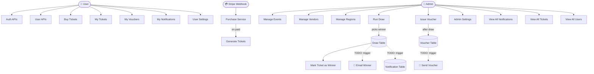
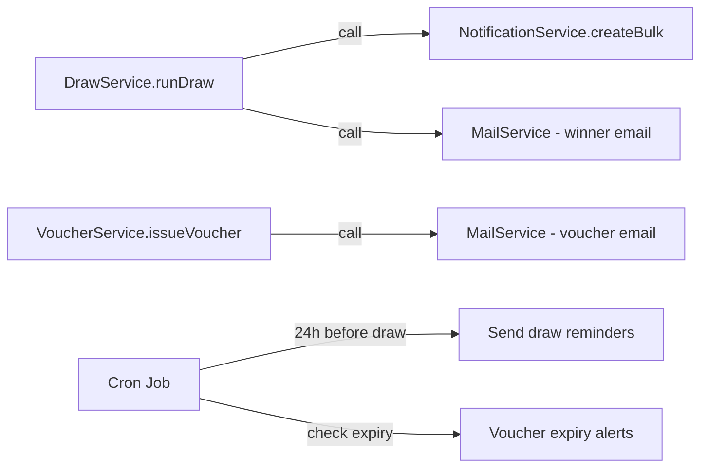
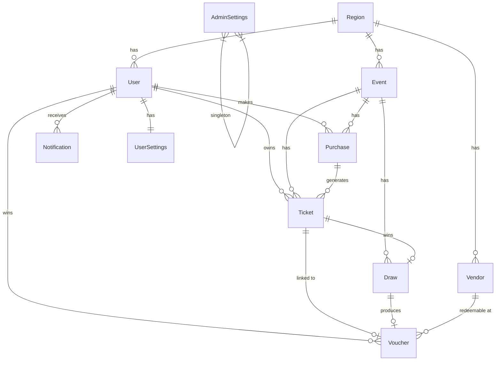

# API Reference & System Diagram

## ⚠️ Important: What's NOT Done Yet
> **Email sending and notification dispatch are NOT automatically triggered** by draw or voucher creation.
> The `NotificationService` has `create()` / `createBulk()` helper methods, and `MailModule` exists — but they are **not yet wired** into `DrawService` or `VoucherService`.
> Those connections are the **next step** to implement.

---

## System Flow Diagram

---

## All API Endpoints

### 🔐 Auth — `/api/v1/auth`
| Method | Endpoint | Access | Description |
|--------|----------|--------|-------------|
| `POST` | `/register` | Public | Register new user |
| `POST` | `/login` | Public | Login, returns JWT |
| `POST` | `/refresh` | Public | Refresh access token |
| `POST` | `/logout` | Auth | Logout |
| `POST` | `/forgot-password` | Public | Send OTP to email |
| `POST` | `/reset-password` | Public | Reset with OTP |
| `POST` | `/change-password` | Auth | Change password |
| `GET` | `/me` | Auth | Get current user |

---

### 👤 User — `/api/v1/user`
| Method | Endpoint | Access | Description |
|--------|----------|--------|-------------|
| `GET` | `/` | Admin | List all users |
| `PATCH` | `/profile` | Auth | Update own profile + photo |
| `PATCH` | `/:id/status` | Admin | Toggle user active/inactive |

---

### 🌍 Region — `/api/v1/regions`
| Method | Endpoint | Access | Description |
|--------|----------|--------|-------------|
| `POST` | `/` | Admin | Create region |
| `GET` | `/` | Public | List all regions |
| `GET` | `/:id` | Public | Get single region |
| `PATCH` | `/:id` | Admin | Update region |
| `DELETE` | `/:id` | Admin | Delete region |

---

### 🏪 Vendor — `/api/v1/vendors`
| Method | Endpoint | Access | Description |
|--------|----------|--------|-------------|
| `POST` | `/` | Admin | Create vendor |
| `GET` | `/` | Public | List all vendors |
| `GET` | `/:id` | Public | Get single vendor |
| `PATCH` | `/:id` | Admin | Update vendor |
| `DELETE` | `/:id` | Admin | Delete vendor |

> **Note:** `voucherValue` is now `Decimal(10,2)` (was Float)

---

### 🎪 Event — `/api/v1/events`
| Method | Endpoint | Access | Description |
|--------|----------|--------|-------------|
| `POST` | `/` | Admin | Create event with dates, pricing, limits |
| `GET` | `/` | Public | List all events (with region) |
| `GET` | `/:id` | Public | Get event details |
| `PATCH` | `/:id` | Admin | Update event |
| `DELETE` | `/:id` | Admin | Delete event |

> **Note:** `ticketPrice` and `prizeValue` are now `Decimal(10,2)` (was Float)

---

### 💳 Purchase — `/api/v1/purchase`
| Method | Endpoint | Access | Description |
|--------|----------|--------|-------------|
| `POST` | `/buy` | Auth | Create Stripe checkout session |
| `POST` | `/webhook` | Public (Stripe) | Handle payment completion, auto-generates tickets |

> **Flow:** User buys → Stripe checkout → Webhook fires → Tickets generated with formatted numbers (`TKT-{REGION}-{SERIAL}`)

---

### 🎫 Ticket — `/api/v1/tickets`
| Method | Endpoint | Access | Description |
|--------|----------|--------|-------------|
| `GET` | `/` | Admin | All tickets · filter by `eventId`, `userId`, `isWinner`, `searchTerm` · paginated |
| `GET` | `/my-tickets` | Auth | Current user's tickets · same filters |
| `GET` | `/:id` | Auth | Single ticket with full details |
| `PATCH` | `/:id` | Admin | Update ticket (mark winner, prize claimed) |

---

### 🎯 Draw — `/api/v1/draws`
| Method | Endpoint | Access | Description |
|--------|----------|--------|-------------|
| `POST` | `/run` | Admin | **Run a draw** for an event |
| `GET` | `/` | Admin | List all draws · filter by `eventId`, `winnerId` · paginated |
| `GET` | `/:id` | Auth | Single draw result (public result viewing) |

**`POST /draws/run` does:**
- Validates event exists and hasn't been drawn
- Checks `minTicketForDraw` from AdminSettings
- Randomly picks a winning ticket from all `paid` tickets
- Records Draw with winner, method, participant count
- Marks the winning Ticket with `isWinner: true`
- ❌ Does NOT yet send email or create notification automatically

---

### 🎁 Voucher — `/api/v1/vouchers`
| Method | Endpoint | Access | Description |
|--------|----------|--------|-------------|
| `POST` | `/issue` | Admin | Issue voucher to draw winner + assign vendor |
| `GET` | `/` | Admin | All vouchers · filter by `code`, `status`, `userId`, `vendorId` · paginated |
| `GET` | `/my-vouchers` | Auth | Current user's vouchers |
| `GET` | `/:id` | Auth | Single voucher details |
| `POST` | `/:id/redeem` | Auth | User redeems their voucher |

**`POST /vouchers/issue` does:**
- Requires `drawId` + `vendorId` + `expiresInDays`
- Generates voucher code: `VCH-{REGION_INITIALS}-{SERIAL}`
- Value taken from `vendor.voucherValue` or falls back to `event.prizeValue`
- ❌ Does NOT yet send email automatically

**`POST /vouchers/:id/redeem` does:**
- Validates voucher belongs to the calling user
- Checks status is ACTIVE
- Checks expiry date
- Sets status → REDEEMED with timestamp

---

### 🔔 Notification — `/api/v1/notifications`
| Method | Endpoint | Access | Description |
|--------|----------|--------|-------------|
| `GET` | `/my` | Auth | My notifications · filter by `type`, `isRead` · paginated + **unread count** |
| `PATCH` | `/my/read-all` | Auth | Mark ALL my notifications as read |
| `PATCH` | `/my/:id/read` | Auth | Mark single notification as read |
| `GET` | `/` | Admin | All users' notifications with filters |

**Notification Types available:**
`DRAW_REMINDER` · `WINNER_ANNOUNCEMENT` · `VOUCHER_ISSUED` · `VOUCHER_EXPIRY` · `DRAW_RESULT` · `MARKETING` · `WEEKLY_DIGEST` · `SYSTEM`

> **Status:** Only storage is implemented. `NotificationService.create()` and `createBulk()` exist as internal helpers ready to be called — but **no service currently triggers them automatically**.

---

### ⚙️ Settings — `/api/v1/settings`
| Method | Endpoint | Access | Description |
|--------|----------|--------|-------------|
| `GET` | `/user` | Auth | Get my preferences (auto-created with defaults if first time) |
| `PATCH` | `/user` | Auth | Update my preferences |
| `GET` | `/admin` | Admin | Get global platform settings |
| `PATCH` | `/admin` | Admin | Update global platform settings |

**User settings fields:**
| Field | Default | Meaning |
|-------|---------|---------|
| `drawReminder` | `true` | 24h before draw notification |
| `winnerAnnouncement` | `true` | Notify about winners |
| `marketingEmails` | `true` | Marketing comms |
| `weeklyDigest` | `true` | Weekly summary |
| `voucherExpiryAlert` | `true` | Alert before voucher expires |
| `showOnWinnersList` | `true` | Privacy: appear on public winners list |

**Admin settings fields:**
| Field | Default | Meaning |
|-------|---------|---------|
| `maintenanceMode` | `false` | Disable ticket sales |
| `automatedDraws` | `false` | Auto-run draws |
| `drawDay` | `null` | e.g. `"MONDAY"` |
| `drawTime` | `null` | e.g. `"18:00"` |
| `maxTicketPerUser` | `10` | Per-event ticket limit |
| `minTicketForDraw` | `1` | Min tickets before draw |
| `emailWinners` | `true` | Auto-email winner |
| `emailAllParticipants` | `true` | Email all on draw result |
| `smsWinnerNotifications` | `false` | SMS to winner |
| `adminDrawAlerts` | `true` | Alert admins on draw |
| `lowParticipationAlert` | `true` | Alert if tickets low |
| `lowParticipationThreshold` | `10` | Threshold (ticket count) |
| `marketingEmailsToUsers` | `true` | Send marketing |
| `drawReminders` | `true` | 24h draw reminder |
| `autoSendVouchers` | `true` | Auto-send vouchers after draw |

---

## 🔧 What Needs to Be Wired Next

1. **Wire `DrawService` → `NotificationService`** — after draw, create `WINNER_ANNOUNCEMENT` notification for winner and `DRAW_RESULT` for all participants (respecting `emailAllParticipants` setting)
2. **Wire `DrawService` → `MailService`** — email the winner (respecting `emailWinners` setting)
3. **Wire `VoucherService` → `MailService`** — email the voucher (respecting `autoSendVouchers` setting)
4. **Add Cron Jobs** — draw reminders 24h before, voucher expiry alerts
5. **Respect `UserSettings`** — check user's `drawReminder`, `winnerAnnouncement`, etc. before sending

---

## Data Relationships

